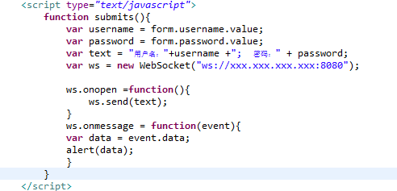
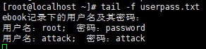
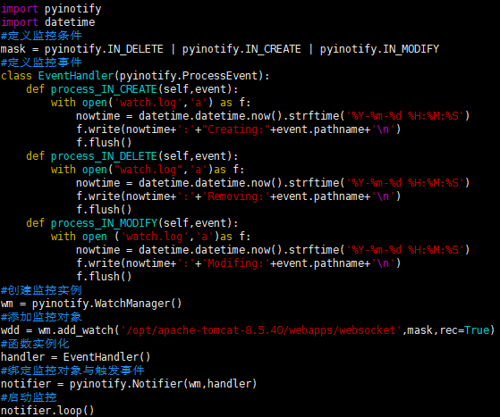
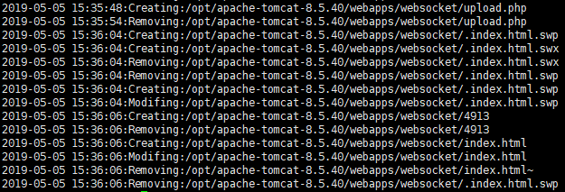
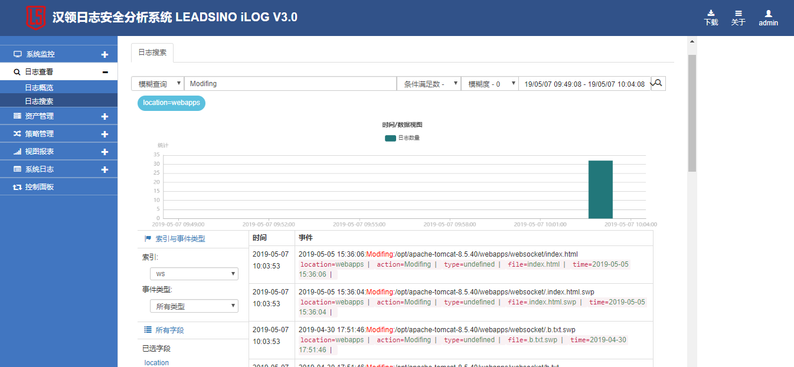

## linux下的文件监控

​	随着信息网络的迅速发展，网站已经成为互联网中的重要组成部分。与此同时，由于各类Web应用系统的复杂性和多样性，特别是缺乏一些必要的安全性维护，导致网页篡改事件频发。利用网站漏洞（如上传木马，SQL注入，利用公开漏洞进行攻击）实现对网站主机控制并篡改网站页面往往是导致网页篡改的主要原因。当然现在市面上已经存在许多网页防篡改系统，通过这些系统能够很好的帮助管理者进行对网站的管理和维护。但是它们往往价格不菲，所以有没有一种方式能够帮助网站管理者无需花费额外的代价便能很好的防止自身网页被篡改呢？本文主要描述的便是通过对文件的监控来实现这一目标。

​	（1）网页被篡改的危害

​	小实验：一台被劫持的服务器（主页被插入了一段能与外部主机建立通信的JS代码），一台外部主机（用于与外部主机建立连接）

​	原理：在服务器内插入一段JS代码,作用为与外部主机建立websocket连接（跨域、双向），从而传输记录下的敏感数据。

​	1.用户登录此网站	

​	2.外部主机接收到普通用户输入的隐私信息

​	可想而知，若是缺乏网络安全意识的用户密码以此方式被黑客获取，造成的危害将是巨大的。

​	（2）Python脚本实现对敏感目录下文件的监控

​	网站的管理者可以利用Python中的Pyinotify模块（Pyinotify模块依赖于Linux内核的功能）监测文件系统的变化（文件的创建，修改，读取，删除等），利用简单的python脚本实现对网站敏感文件的实时监控。 

​	Pyinotify的使用可以分为三步：1.定义监控条件和触发事件。 2.添加监控对象。 3.绑定监控对象和触发事件。

​	通过这一Python脚本可以简单的实现对目标文件夹及其文件的监控，并且能够在日志文件中查看对应的日志信息（上传敏感文件，修改敏感文件，删除敏感文件等），通过监控其日志文件，网站管理者已经可以实时知晓其所拥有的网站是否被恶意篡改及被篡改的页面，及时进行处理，从而能很大程度上减少黑客攻击（服务器被上传木马，页面被篡改等）造成的危害。

​	（3）利用日志分析系统进行危险信息收集、筛选以及告警（进阶）

​	

​	上图是利用汉领安全日志分析系统对目标网站的敏感日志进行监控分析的结果。

​	网站管理者可以通过rsyslog将文件监控产生的日志转发到日志分析系统中对网站进行实时监控，并通过日志分析系统的告警策略生成告警，从而体会到实时感知网站敏感文件的变化（监控）的“畅快”感觉。

​	