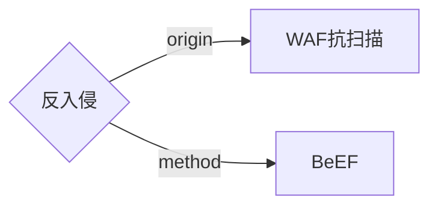

### 					反入侵	



#### 1 BeEF是什么

​	是专门针对浏览器攻击的框架。


​	zombie（僵尸）即受害的浏览器。zombie是被hook（勾连）的，如果浏览器访问了有勾子（由js编写）的页面，就会被hook，勾连的浏览器会执行初始代码返回一些信息，接着zombie会每隔一段时间（默认为1秒）就会向BeEF服务器发送一个请求，询问是否有新的代码需要执行。BeEF服务器本质上就像一个Web应用，被分为前端UI， 和后端。前端会轮询后端是否有新的数据需要更新，同时前端也可以向后端发送指示， BeEF持有者可以通过浏览器来登录BeEF 的后台管理UI。

#### 2.反入侵

#### 2.1 反入侵准备

​	将一个测试用的业务系统（DVWA）的地址反向代理到汉领下一代应用防火墙的IP+PORT上，并利用汉领下一代应用防火墙的内容替换功能，向业务系统的某个页面加入一个无内容的a标签，如

```html
<a href="http://10.10.xxx.xx:xx/xxx.php"></a>
```

​	此链接中包含一个精心构造的js，当有攻击行为触发此js时，可以通过获取攻击来源的一些信息。

#### 2.2 反入侵原理


#### 2.3 反入侵实践

​	反入侵方使用WAF往指定业务系统界面植入<a>标签链接；链接是一个具有sql注入漏洞的网页，其中包含了一个精心构造的js，当扫描器对此链接发出http(s)请求时，会触发此JS，同时扫描器会被此具有漏洞的网页“吸引”，从而保持入侵方与反入侵方的连接；此时反入侵方可以使用BeEF框架中的一些工具就可以获取入侵方的一些网络信息，甚至是控制入侵方的浏览器进行更深层次的入侵。

​	（1）反入侵方使用汉领新一代Web应用防火墙往指定网页上添加<a>标签。


​	（2）此时测试用业务系统（DVWA）网页源代码中，多出一个a标签。


​	（3）入侵方用AWVS对此业务系统进行扫描。


​	（4）通过BeEF服务器"hook"扫描器。


​	此时反入侵方成功获取到入侵方的一些信息。

