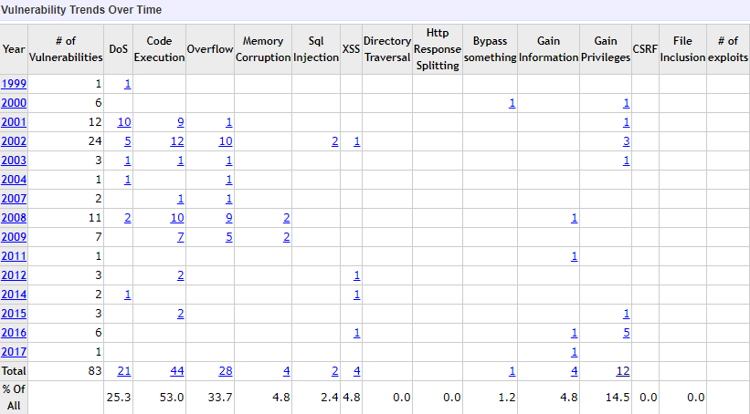
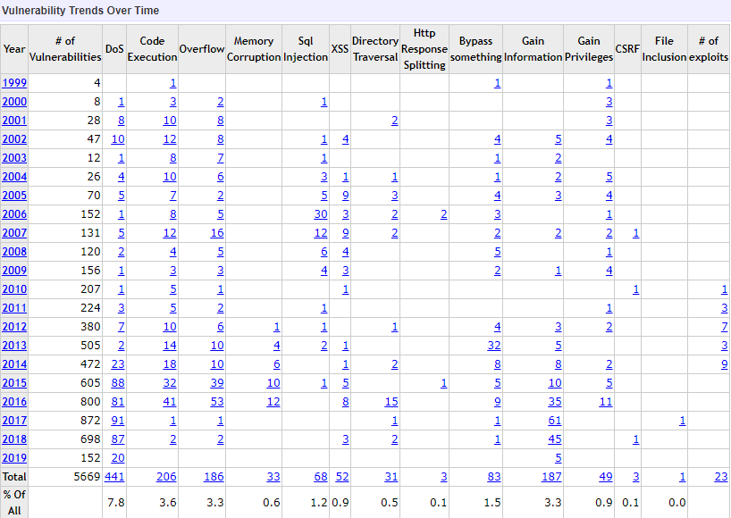

### 		如何通过数据库入侵防御系统解决数据库的漏洞利用

​	2018年1月，印度国家身份认证系统Aadhaar（世界上最庞大最复杂的生物身份识别系统（UID），截止至2017年2月已采集印度11.2亿人的生物识别数据（包括照片、指纹及虹膜等），并提供独一无二的身份证明编号。）被曝遭网络攻击，数据被明码标价出售。经记者证实，支付500卢比（约48元人民币）后，可输入任何Aadhaar号码检索相关信息，包括包括姓名、住址、照片、电话号码和邮箱地址等。

​	2018年3月，一家名为Cambridge Analytica的数据分析公司通过一个应用程序收集了5000万Facebook用户的个人信息，该应用程序详细描述了用户的个性、社交网络以及在平台上的参与度。 

​	2018年6月，国内著名网站弹幕视频网站 AcFun（A 站）在官网发布 《关于AcFun 受黑客攻击致用户数据外泄的公告》称，该网站曾遭遇黑客攻击，近千万条用户数据已发生外泄，其中包括用户ID、昵称以及加密存储的密码等数据均遭泄露。

​	2018年8月，媒体爆料华住旗下连锁酒店开房数据在暗网被明码标价公开售卖，包括华住旗下汉庭、桔子等酒店。被泄露的数据为华住官网注册资料、酒店入住登记身份信息和酒店开房记录，内容包括姓名、手机号、邮箱、身份证号码等，共计140G约5亿条信息。 

​	2018年11月，万豪官方微博公开发布声明，称“2018年9月10日及之前喜达屋旗下酒店预定数据库中的宾客信息曾在未授权的情况下被访问”，最多约5亿名预定该酒店的用户信息或被泄露。

​	源源不断的数据泄露事件在世界各地发生，其涉及面积之大、影响范围之广令人咋舌，而随着“数据安全“连续三年登顶全球网络安全热词，不难看出，数据安全已成为网络安全领域的重中之重。

​	当今，企业信息化建设不断加快，不仅是互联网公司，各个行业的传统企业巨头也在企业信息化建设上不遗余力，从企业内部的CRM、邮件系统、到外部的企业应用，越来越多的关键业务系统运行在数据库平台之上，与此同时，越来越多的企业数据也被存储在了数据库之中。此时，”如何保证数据的安全”这一问题便演变成“如何保证数据库的安全”。

​	现在企业内部广泛使用的数据库主要有Oracle，SQL Server，MySQL。

​	（1）SQL Server历年CVE漏洞统计

​	（2）Oracle，MySQL历年CVE漏洞统计

​	作为数据中心的数据库已经成为了黑客的首选攻击目标。而安全漏洞库CVE （Common Vulnerabilities & Exposures，通用漏洞披露）也为大量黑客提供了攻击参照。通常黑客会通过扫描器进行公网下/指定目标的扫描，得到扫描结果后利用相应的攻击脚本进行攻击。

​	*tips：CVE——是对已知漏洞和安全缺陷的标准化名称的列表，其使命是为了能更加快速而有效地鉴别、发现和修复软件产品的安全漏洞。*	

​	而由于数据库管理者安全意识、技术水平的参差不齐，往往会导致安全配置较弱的数据库更容易遭受黑客的攻击，所以在这一背景下，很有必要使用专业的数据库安全产品，专门对企业内部的数据库作专业的保护。

​	**汉领信息科技有限公司**自行研制开发的新一代数据防护系统**数据库入侵防御系统**是一款通过对访问数据库的数据流进行采集、分析和识别，实时监控数据库运行状态，记录多种访问数据库行为，发现对数据库的异常访问，并进行及时、精确阻断的数据库安全产品。它通过专门细致的网络数据获取协议分析技术、非法操作防护技术、数据保护技术并配合完善的管理规则，帮助访问者应对来自网络中的风险和挑战。

​	本文以MySQL为实验对象，选取了流传范围较广、危害较大的MySQL漏洞CVE-2016-6663(’mysql‘系统用户提权漏洞)进行试验。

​	**数据库入侵防御系统通过精准的防火墙策略阻断CVE漏洞：**

​	  (1)

​	（2）受影响的数据库版本

​	MariaDB 
   		 < 5.5.52

​	MySQL  
 		 <= 5.5.51
​		 <= 5.6.32
   		 <= 5.7.14

​	Percona Server
  		 < 5.5.51
   		 < 5.6.32
 		 < 5.7.14	

​	（3）漏洞验证

​	实验系统用户为本地普通系统用户：

​       本地普通系统用户具有拥有create/insert/select/drop权限的普通数据库用户test，可操作数据库为test数据库。

​	运行exp:

​	运行结果：

​	（4）漏洞危害

​	攻击者利用该漏洞可以执行任意代码并且可以提升权限到mysql系统用户。这会使他们有权限访问服务器上的所有的数据库文件，结合CVE-2016-6662或者CVE-2016-6664可以进一步提升权限到root用户。

​	此漏洞可以被共享环境（每个用户都被分配了一个可以访问的数据库）下的恶意用户利用，还可以被通过web入侵的已经获得了低权限用户(如apache/www-data用户)的攻击者利用。

​	（5）结合数据库入侵防御系统防护数据库

​	漏洞原理：攻击者在对拥有create权限的数据库用户在指定路径下建表（create table）后，运行“**REPAIR TABLE**” SQL语句时，会存在一个对临时文件的不安全的文件操作。

​	数据库管理者可以通过数据库入侵防御系统的行为防火墙将“**REPAIR TABLE**”语句作出告警甚至拒绝，能够让数据库管理员第一时间发现数据库系统是否被攻击并作出应对，极大降低此漏洞风险。

​	目前，汉领信息科技有限公司下属的汉武实验室正在不断收集一些流传范围广、危险程度高的与数据库相关的CVE漏洞，并会在未来将这些漏洞解决方法加入到我们的数据库入侵防御系统内部，使之成为一个“天然的”CVE数据库漏洞保护屏障。

